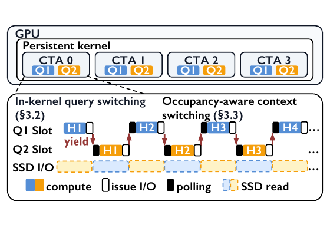
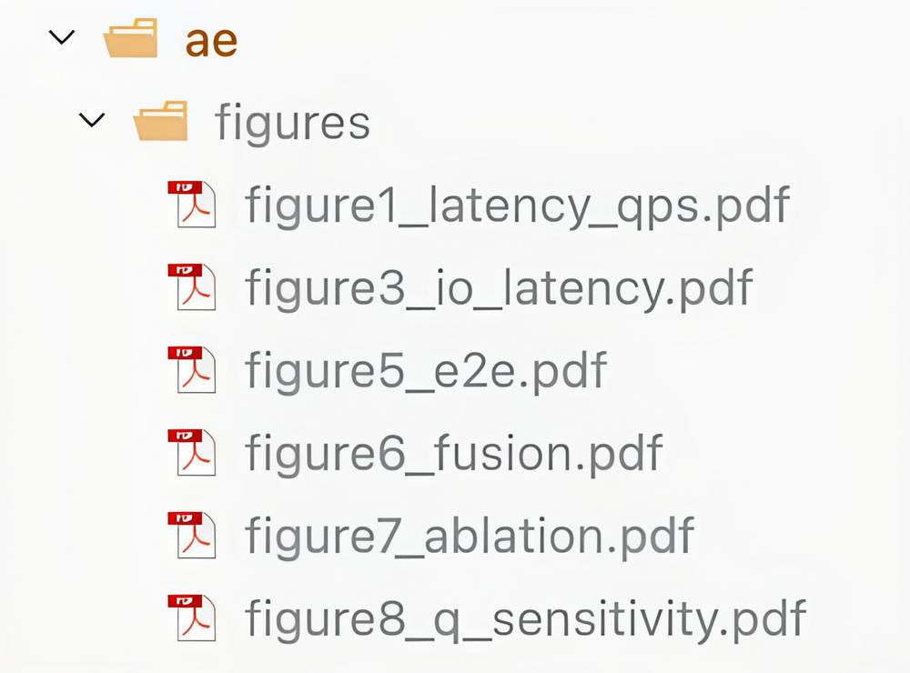
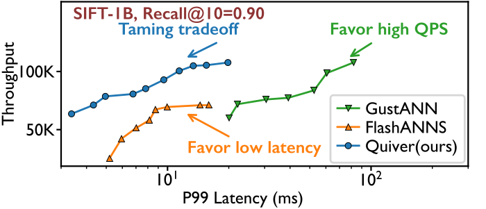

# [ATC'26 Artifact] Quiver Artifact Evaluation Guide

Welcome to the artifact repository of the ATC'26 accepted paper: *Quiver: Taming the Throughput-Latency Tradeoff in GPU-SSD ANNS*!

Should there be any questions, please contact the authors in HotCRP. The authors will respond to each question within 24hrs and as soon as possible.

## Main Claims

**Major Claim 1:** At matched Recall@10, Quiver advances the throughput-latency Pareto frontier over existing graph-based GPU-SSD ANNS systems, achieving higher peak throughput and lower P99 latency at matched throughput. (Figures 1 and 5)

**Major Claim 2:** At matched Recall@10, Quiver outperforms the cluster-based GPU-SSD system FusionANNS in both peak throughput and throughput under P99 latency constraints. (Figure 6)

**Major Claim 3:** Quiver's In-Kernel Query Switching (+S) and Occupancy-Aware Context Switching (+C) work synergistically to improve performance, while tuning the per-CTA query context count Q_num balances GPU utilization against queueing delay. (Figures 7 and 8)

## Overview

### Directory structure

```
quiver-ae/           # artifact root
|-- bin/             # executable entry points
|-- src/
|   |-- quiver/      # kernels and I/O control
|   |-- flashanns/   # FlashANNS
|   |-- gustann/     # GustANN
|   +-- shared/      # index, I/O, and metrics
|-- deps/
|   +-- spdk/        # userspace NVMe stack
|-- third-party/
|   +-- fusionanns/  # FusionANNS
+-- ae/              # evaluation package
    |-- config.env   # GPU, paths, and PCIe
    |-- scripts/     # build, run, and plot
    |-- figures/      # reproduced paper figures (vector PDFs)
    +-- results/     # raw logs and CSVs
        +-- Pre-executed-logs/ # reference logs
```

### Overview of Quiver

A persistent GPU kernel runs the search. Each CTA holds multiple query contexts. In-kernel query switching (§3.2) runs another ready context when one waits on an SSD read. Occupancy-aware context switching (§3.3) chooses how many contexts stay resident.



## Environment Setup

**To artifact reviewers:** on our server, skip this section and go to [Evaluate the Artifact](#evaluate-the-artifact). The environment there is already prepared. On another machine, follow the steps below.

### Hardware Requirements

A GPU with at least 40 GB of memory is required, since the billion-scale PQ codes occupy 32 GB. The host needs 64 GB of memory and four NVMe SSDs. Binding these SSDs needs passwordless `sudo`.

### Software Requirements

Install the following software.

**CUDA.** Quiver, FlashANNS, and GustANN are compiled with CUDA 12.x. On Ubuntu 24.04, install the toolkit and put `nvcc` on `PATH`:

```bash
wget -O /tmp/cuda-keyring.deb \
"https://developer.download.nvidia.com/compute/cuda/repos/ubuntu2404/x86_64/cuda-keyring_1.1-1_all.deb"
sudo dpkg -i /tmp/cuda-keyring.deb
sudo apt-get update
sudo apt-get install -y cuda-toolkit-12-8
export PATH=/usr/local/cuda/bin:$PATH
```

**SPDK.** SPDK provides the userspace NVMe path. The source is in `deps/spdk`. Install its dependencies and build it:

```bash
sudo deps/spdk/scripts/pkgdep.sh
cd deps/spdk
./configure
make -j
```

**FusionANNS.** This baseline is built with xmake. Install Boost, OpenBLAS, liburing, and xmake:

```bash
sudo apt-get install -y libboost-all-dev \
    libopenblas-dev liburing-dev
curl -fsSL https://xmake.io/shget.text | bash
```

## Evaluate the Artifact

### Login to the provided server

The project root on the pre-configured AE server is `/mnt/nvme12/wpq-ae/home/quiver-ae`.

```bash
ssh -p 1558 wpq@536501659b72a831.natapp.cc
cd /mnt/nvme12/wpq-ae/home/quiver-ae
```

### Building Quiver from source

Compile Quiver and the baselines with:

```bash
./ae/scripts/build.sh
```

### Hello-world example

Run the one-minute SIFT-1M smoke test before reproducing the paper figures:

```bash
./ae/scripts/hello_world.sh
```

On success, it prints output similar to:

```
===== hello-world result =====
Dataset: SIFT-1M
Sweep: num_blocks=108 queries_per_block=2
  Recall @10 = 0.9057
  QPS = 94669.3  avg = 2.25 ms  P99 = 6.98 ms
===============================
```

### Run all experiments

The scripts reproduce all six paper figures at once, or one figure at a time.

**#1: Reproduce all figures.**

```bash
./ae/scripts/run_all.sh
```

This command takes approximately 4 hours at billion scale. Rerunning an experiment replaces its directory in `ae/results/`.

**#2: Reproduce selected figures.** Pass a name from the table below:

```bash
./ae/scripts/run_all.sh <name>
```

| Figure | Name | Time (h) |
|--------|------|----------|
| 1 | `latency_qps` | 0.5 |
| 3 | `io_latency` | 0.5 |
| 5 | `e2e` | 1.0 |
| 6 | `fusion` | 1.0 |
| 7 | `ablation` | 0.5 |
| 8 | `q_sensitivity` | 0.5 |

### Plot all figures

Plot every completed figure with:

```bash
./ae/scripts/plot_all.py
```

To generate all six figures directly from the bundled pre-executed logs, without rerunning the experiments, use:

```bash
./ae/scripts/plot_all.py ae/results/Pre-executed-logs
```

Each PDF is saved in `ae/figures/`. The number is the paper figure, and the suffix is the name in the table above.



`figure1_latency_qps.pdf` is the reproduced Figure 1.



### Detailed claims & Experimental result verification

**Major Claim 1:** At matched Recall@10, Quiver advances the throughput-latency Pareto frontier over existing graph-based GPU-SSD ANNS systems.

Sub-claims:

- vs. FlashANNS (Figure 5): peak throughput is 28–55% higher. At the same throughput, P99 latency is 47–68% lower.
- vs. GustANN (Figure 5): the same peak throughput, and P99 latency is 81–87% lower.
- Figure 1: Quiver dominates both baselines.

Verification:

```bash
./ae/scripts/run_all.sh latency_qps
./ae/scripts/run_all.sh e2e
```

**Major Claim 2:** At matched Recall@10, Quiver outperforms the cluster-based GPU-SSD system FusionANNS in peak throughput and under P99 latency constraints.

Sub-claims:

- On SIFT-1B and DEEP-1B (Figure 6), peak throughput is 3.4×–3.8× higher.
- Under a 15 ms P99 budget (Figure 6), throughput is 9.1×–13.1× higher.

Verification:

```bash
./ae/scripts/run_all.sh fusion
```

**Major Claim 3:** Quiver's In-Kernel Query Switching and Occupancy-Aware Context Switching synergistically improve performance, while Q_num balances GPU utilization against queueing delay.

Sub-claims:

- In-Kernel Query Switching (+S, Figure 7a): 16.3%–65.1% higher than FlashANNS at a 10 ms P99 target.
- Occupancy-Aware Context Switching (+C, Figure 7a): with +S, 43.9%–96.7% higher than FlashANNS.
- I/O-induced latency is 2.0× lower than FlashANNS and 4.6× lower than GustANN (Figure 7b).
- GPU utilization (Figure 8b): raising Q_num from 1 to 8 increases utilization from 42.8% to 95.0%.
- Throughput peak (Figure 8a): Q_num = 4 at Recall@10 of 0.90 and 0.94, and Q_num = 2 at 0.96.

Verification:

```bash
./ae/scripts/run_all.sh ablation
./ae/scripts/run_all.sh q_sensitivity
```
