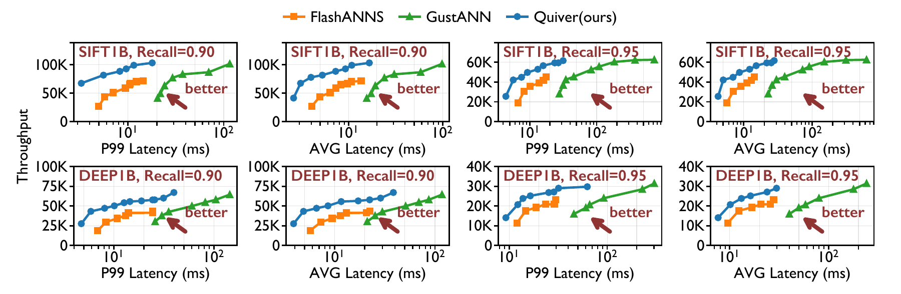

<p align="center">
  
</p>

<h3 align="center">
A low-latency, high-throughput, and billion-scale GPU-SSD vector search system.
</h3>

<p align="center">
  <a href="README-AE.md"><strong>ATC'26 Artifact Evaluation Guide</strong></a>
</p>

## ✨ Key Features

| Feature | Description |
|---------|-------------|
| ⚡&nbsp;**Ultra-Low&nbsp;Latency** | 2.94 ms P99 on SIFT-1B and 4.73 ms P99 on DEEP-1B (top-10, 90% recall, 4 SSDs) |
| 📈&nbsp;**High&nbsp;Throughput** | 104.5K QPS on SIFT-1B and 59.5K QPS on DEEP-1B (top-10, 90% recall, 4 SSDs) |
| 🌐&nbsp;**Billion-Scale&nbsp;Search** | Searches SIFT-1B and DEEP-1B on a single 40 GB GPU, with the billion-scale graph stored on NVMe SSDs |
| 💾&nbsp;**Memory&nbsp;Efficient** | Keeps only 32 GB PQ codes in GPU memory instead of loading the full graph into GPU memory |
| 🐍&nbsp;**Easy-to-Use** | Both Python (`NumPy`-native) and C++ interfaces are supported |
| 🔌&nbsp;**Flexible&nbsp;Backends** | Use the SPDK backend for direct NVMe access, or the memory backend with `mmap` and `heap` loading modes |
| 🗄️&nbsp;**Direct&nbsp;NVMe&nbsp;I/O** | SPDK-based userspace I/O supports direct access to one or multiple NVMe SSDs with page-level striping |

> Results use Recall@10 = 0.90 on an NVIDIA A100 40 GB GPU with four NVMe SSDs.

## 📊 Performance Comparison

Quiver is suitable for both **high-throughput** and **latency-sensitive** billion-scale ANNS.

| Dataset | Dimension | Recall@10 | P99 Target | Quiver | FlashANNS | GustANN |
|---------|-----------|-----------|------------|--------|-----------|---------|
| SIFT-1B | 128 | 0.90 | ≤10 ms | ✅ **97.8K QPS** | 63.8K QPS | ❌ 20.4 ms minimum P99 |
| DEEP-1B | 96 | 0.90 | ≤10 ms | ✅ **45.0K QPS** | 26.8K QPS | ❌ 33.8 ms minimum P99 |
| SIFT-1B | 128 | 0.95 | ≤10 ms | ✅ **42.5K QPS** | 28.6K QPS | ❌ 29.5 ms minimum P99 |
| DEEP-1B | 96 | 0.95 | ≤10 ms | ✅ **12.7K QPS** | ❌ 12.8 ms minimum P99 | ❌ 51.7 ms minimum P99 |

> Recall@10 = 0.90/0.95, NVIDIA A100 40 GB GPU, four Samsung PM1743 NVMe SSDs.

<p align="center">
  
</p>

---

## 🚀 Quick Start

For best performance, we recommend Ubuntu 24.04 with CUDA 12.x and SPDK-compatible NVMe SSDs.

### 🏗️ Build

Install the build dependencies:

```bash
sudo apt-get update
sudo apt-get install -y build-essential cmake python3-dev python3-pip python3-venv

# Install SPDK dependencies and build the bundled SPDK.
sudo deps/spdk/scripts/pkgdep.sh
cd deps/spdk && ./configure && make -j
cd ../..
```

Build the Quiver search engine and SSD writer:

```bash
export PATH=/usr/local/cuda-12.8/bin:"$PATH"  # Adjust for your CUDA 12.x install.
cmake -S . -B build \
  -DCMAKE_BUILD_TYPE=Release \
  -DQUIVER_ENABLE_SPDK=ON \
  -DQUIVER_BUILD_STRAWMEN=OFF
cmake --build build -j"$(nproc)" --target quiver_search spdk_write
```

Install the Python interface:

```bash
python3 -m venv .venv
source .venv/bin/activate
pip install -e .
```

### ⚡ C++

Search an existing on-disk index with Quiver:

```bash
SPDK_BASE_LBA=0 build/bin/quiver_search \
  --index-dir /path/to/index \
  --query /path/to/query.u8bin \
  --data-type uint8 \
  --topk 10 \
  --ef-search 45 \
  --ssd-list-file /path/to/ssd_list.txt \
  --repeat 1 \
  --result-prefix /tmp/quiver-result
```

The result IDs and distances are written to `/tmp/quiver-result_ids.bin` and `/tmp/quiver-result_distances.bin`. Omit `--ssd-list-file` to use the memory backend; select its loading mode with `--memory-backend mmap` or `--memory-backend heap`.

### 🐍 Python

```python
import numpy as np

from quiver import IndexQuiver

query_file = "/path/to/query.u8bin"
count, dimensions = np.fromfile(query_file, dtype="<i4", count=2)
queries = np.fromfile(query_file, dtype=np.uint8, offset=8).reshape(count, dimensions)

idx = IndexQuiver(
    index_dir="/path/to/index",
    data_type="uint8",
    ssd_list_file="/path/to/ssd_list.txt",
    spdk_base_lba=0,
)

ids, distances = idx.search(queries, topk=10, ef_search=45)
```

`queries` is a two-dimensional NumPy array. Pass PCI addresses directly through `ssds=[...]`, or use an existing `ssd_list_file`, to select the SPDK backend. Omit both options to use the memory backend with either `mmap` or `heap` mode.

See the [Artifact Evaluation Guide](README-AE.md) for CUDA installation, index preparation, SPDK device binding, and full experiment reproduction.

## 📰 Updates

- **Sep 24, 2026**: Initial release with billion-scale GPU-SSD search, C++ and Python interfaces, and SPDK and memory backends

---

## 📖 Citation

If you use Quiver in your research, please cite our forthcoming ACM SIGOPS ATC '26 paper:

```bibtex
@inproceedings{wu2026quiver,
  author    = {Puqing Wu and Minhui Xie and Yiheng Tong and Jie Yin and
               Sen Yang and Yunpeng Chai},
  title     = {Quiver: Taming Throughput-Latency Tradeoff in GPU-SSD ANNS},
  booktitle = {ACM SIGOPS Annual Technical Conference (ACM SIGOPS ATC '26)},
  year      = {2026},
  note      = {To appear}
}
```
